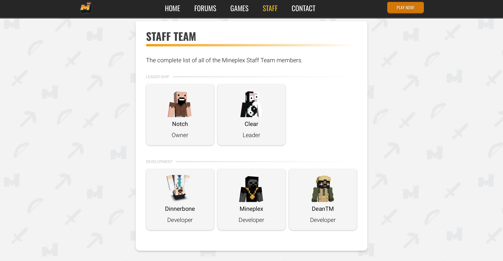
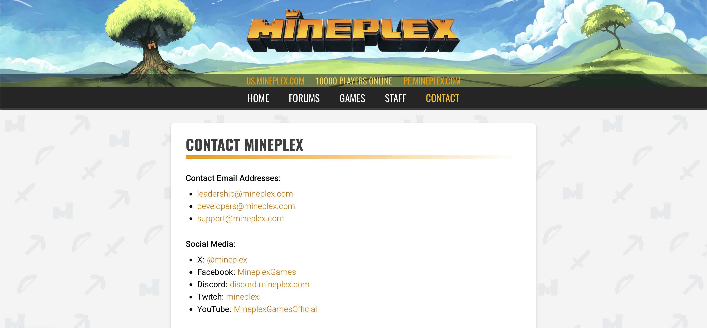

#  Website

This repository contains unofficial source code of Mineplex website.
The project started as for fun project & is separate on two parts `backend` & `frontend`

### Contains

##### Backend

- PostgreSQL - The SQL database
- Quarkus - Java Framework
- GraphQL - Technology from Meta

##### Frontend

- NextJS - NodeJS Framework for React
- TailwindCSS - The Node.js module for design
- ShadCN UI - Component library for building modern React interfaces
- GSAP - Professional animation library for web interactions
- Axios - Promise-based HTTP client for browser and Node.js

### Images

**Main Page** - Frontend

**Staff Team Page** - Frontend

**Contact Page** - Frontend

-----

Copyright &copy; 2026 | [Authors](./AUTHORS)
