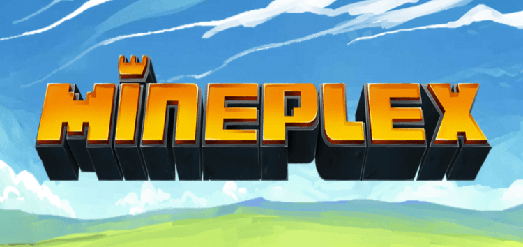

# Backend
[](https://choosealicense.com/licenses/mit/)

The source code of unofficial Mineplex website micro-services
## Features

- GraphQL
- PostgreSQL as database
- Hibernate (ORM - Object-Relational Mapping)
- Common for every microservice
- Modern Java 17 version


## Development
To copy development environment files type
```shell
python3 scripts/copy-env.py
```

-----

Copyright &copy; 2026 | [Authors](../AUTHORS)
